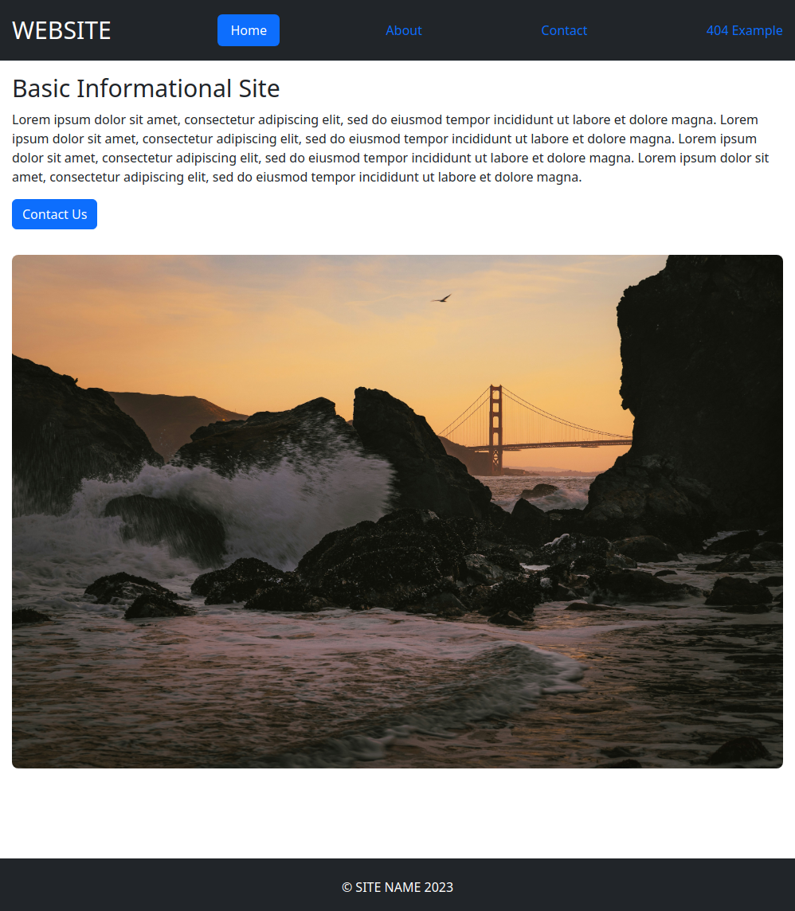

# Odin Project #22: Basic Informational Site

Originally the goal of this Odin Project assignment was to create a simple information site by setting up a Node.js server and 4 HTML pages. The server was very basic and served HTML pages according to the URL. Styling wasn't the goal of this project, so it's looking pretty ugly. I added some Bootstrap styles by trial and error since I've only created my own CSS styles so far. The project has been refactored to use Express instead.

I started and finished this project in February 2024.

## Assignment

[The Odin Project - NodeJS - #22 Part 1 Basic Informational Site](https://www.theodinproject.com/lessons/nodejs-basic-informational-site)

[The Odin Project - NodeJS - #22 Part 2 Introduction to Express](https://www.theodinproject.com/lessons/node-path-nodejs-introduction-to-express#assignment)

## Technology

- Node.js
- Express
- HTML
- Bootstrap

## Key Concepts

- Node.js basics
- HTTP Module: making HTTP requests, http.createServer - creates an HTTP server that accepts handlers that will be executed every time we get a request
- File System: fs module, reading & writing files

## Screenshots



## Sources for images

- https://unsplash.com/photos/W_PrZQrFlis by Kellen Riggin

## Deployment

```bash
# clone repo
git clone https://github.com/BrightNeon7631/odin-basic-informational-site.git

# install project dependencies
npm install

# start server
node app.js
```
